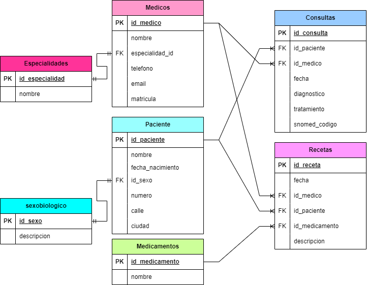
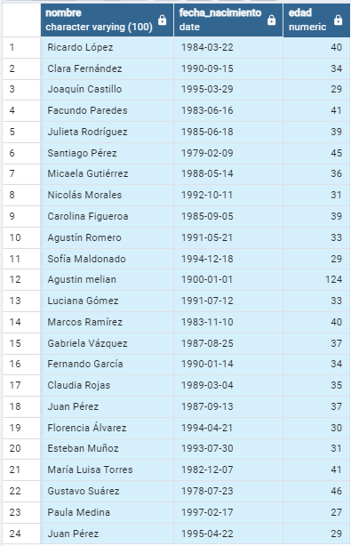

# **Parte 1: Base de datos** 
1) *¿Qué tipo de base de datos es? Clasificarla según estructura y función.*

 La estructura de la base de datos es relacional y su función es transaccional. 
 
2) Diagrama entidad/relación: 

   
  

3) Modelo relacional

   
  

4) *¿Considera que la base de datos está normalizada? En caso que no lo esté, ¿cómo
podría hacerlo? Nota: no debe normalizar la base de datos, solo explicar como lo
haría.*

La base de datos no está normalizada, esto se puede ver especialmente con las ciudades en la cual viven los pacientes. Una misma ciudad tiene distintas formas de ser escrita, lo que complica la búsqueda o se pueden tener resultados erróneos si no se toma en cuenta. Una forma de solucionar estos problemas es tener una tabla de ciudades predeterminadas y la tabla de paciente hace referencia a la tabla de ciudades. Por ejemplo si la PK 1 en la tabla de ciudades corresponde a la ciudad de La Plata esta se encuentre como Fk en la tabla de pacientes. 

# **Parte 2: SQL**

 1) *Cuando se realizan consultas sobre la tabla paciente agrupando por ciudad los tiempos de respuesta son demasiado largos. Proponer mediante una query SQL una
solución a este problema.*

Código SQL:

    CREATE INDEX idx_ciudades ON Pacientes(ciudad);

 2) *Se tiene la fecha de nacimiento de los pacientes. Se desea calcular la edad de los
pacientes y almacenarla de forma dinámica en el sistema ya que es un valor
típicamente consultado, junto con otra información relevante del paciente.*

Código SQL:
  
    SELECT nombre, 
         fecha_nacimiento, 
         EXTRACT(YEAR FROM AGE(CURRENT_DATE, fecha_nacimiento)) AS edad
    FROM pacientes;

   
  

3) *La paciente, “Luciana Gómez”, ha cambiado de dirección. Antes vivía en “Avenida
Las Heras 121” en “Buenos Aires”, pero ahora vive en “Calle Corrientes 500” en
“Buenos Aires”. Actualizar la dirección de este paciente en la base de datos.*

Código SQL:

        SELECT  nombre,numero, calle, ciudad
        	FROM public.pacientes
        	WHERE nombre='Luciana Gómez' ;

   
  

  
4) *Seleccionar el nombre y la matrícula de cada médico cuya especialidad sea
identificada por el id 4.*

Código SQL: 

    SELECT nombre, matricula
    FROM Medicos
    WHERE especialidad_id = 4

5) *Puede pasar que haya inconsistencias en la forma en la que están escritos los
nombres de las ciudades, ¿cómo se corrige esto? Agregar la query correspondiente.* 

Cógido SQL: 

      UPDATE pacientes
      SET ciudad = CASE
          WHEN LOWER(SUBSTR(TRIM(ciudad), 1, 1)) = 'b' THEN 'Buenos Aires'
          WHEN LOWER(SUBSTR(TRIM(ciudad), 1, 1)) = 'c' THEN 'Córdoba'
          WHEN LOWER(SUBSTR(TRIM(ciudad), 1, 1)) = 'm' THEN 'Mendoza'
          WHEN TRIM(ciudad) = 'Rosario' THEN 'Santa Fé'
          ELSE 'Santa Fé'
      END;

6) *Obtener el nombre y la dirección de los pacientes que viven en Buenos Aires.*

Código SQL:

    SELECT nombre, numero, calle, ciudad
    FROM pacientes
    WHERE ciudad = 'Buenos Aires'

7) *Cantidad de pacientes que viven en cada ciudad.*

Código SQL:

    SELECT 
        CASE
            WHEN ciudad = 'Buenos Aires' THEN 'Región 1'
            WHEN ciudad = 'Córdoba' THEN 'Región 2'
            WHEN ciudad = 'Mendoza' THEN 'Región 3'
            WHEN ciudad = 'Santa Fé' THEN 'Región 4'
            ELSE 'Otras Regiones'
        END AS region,ciudad,
        COUNT(*) AS cantidad_paciente
        FROM pacientes
        GROUP BY region, ciudad;

8) *Cantidad de pacientes por sexo que viven en cada ciudad.* 

Código SQL:

    SELECT 
        CASE
            WHEN ciudad = 'Buenos Aires' THEN 'Región 1'
            WHEN ciudad = 'Córdoba' THEN 'Región 2'
            WHEN ciudad = 'Mendoza' THEN 'Región 3'
            WHEN ciudad = 'Santa Fé' THEN 'Región 4'
            ELSE 'Otras Regiones'
        END AS region,
        ciudad,
        id_sexo,
        COUNT(*) AS cantidad_paciente
    FROM pacientes
    GROUP BY region, ciudad, id_sexo;

9) *Obtener la cantidad de recetas emitidas por cada médico.*

Código SQL: 

        SELECT  id_medico,
            COUNT(id_receta) AS cantidad_recetas
        FROM recetas
        GROUP BY id_medico;
10) *Obtener todas las consultas médicas realizadas por el médico con ID igual a 3
durante el mes de agosto de 2024.*

Código SQL:

    SELECT id_consulta
    FROM consultas
    WHERE id_medico = 3
    AND fecha BETWEEN '2024-08-01' AND '2024-08-31';

11) *Obtener el nombre de los pacientes junto con la fecha y el diagnóstico de todas las
consultas médicas realizadas en agosto del 2024.*

Código SQL: 

    SELECT pacientes.nombre, consultas.fecha, consultas.diagnostico
    FROM consultas
    JOIN pacientes ON consultas.id_paciente = pacientes.id_paciente
    WHERE consultas.fecha BETWEEN '2024-08-01' AND '2024-08-31';

12) *Obtener el nombre de los medicamentos prescritos más de una vez por el médico
con ID igual a 2.* 

Código SQL:

    SELECT medicamentos.nombre,
        COUNT(*) AS veces_prescrito
    FROM recetas 
    JOIN medicamentos ON recetas.id_medicamento = medicamentos.id_medicamento
    WHERE recetas.id_medico = 2
    GROUP BY medicamentos.nombre
    HAVING 
        COUNT(*) > 1;

  13)  *Obtener el nombre de los pacientes junto con la cantidad total de recetas que han
recibido.*

Código SQL:

    SELECT pacientes.nombre,
        COUNT(recetas.id_receta) AS cantidad_recetas
    FROM pacientes
    LEFT JOIN recetas ON pacientes.id_paciente = recetas.id_paciente
    GROUP BY pacientes.id_paciente, pacientes.nombre;

14) *Obtener el nombre del medicamento más recetado junto con la cantidad de recetas
emitidas para ese medicamento.*

Código SQL:

        SELECT medicamentos.nombre,
            COUNT(recetas.id_receta) AS cantidad_recetas
        FROM recetas 
        JOIN medicamentos ON recetas.id_medicamento = medicamentos.id_medicamento
        GROUP BY medicamentos.nombre
        ORDER BY cantidad_recetas DESC
        LIMIT 1;

15) *Obtener el nombre del paciente junto con la fecha de su última consulta y el
diagnóstico asociado.*

Código SQL:

    SELECT pacientes.nombre,consultas.fecha,consultas.diagnostico
    FROM pacientes
    JOIN consultas ON pacientes.id_paciente = consultas.id_paciente
    WHERE consultas.fecha = (SELECT MAX(fecha) FROM consultas WHERE id_paciente = pacientes.id_paciente);

  

16) *Obtener el nombre del médico junto con el nombre del paciente y el número total de
consultas realizadas por cada médico para cada paciente, ordenado por médico y
paciente.*

Código SQL: 
    
    SELECT medicos.nombre,pacientes.nombre,
        COUNT(consultas.id_consulta) AS total_consultas
    FROM medicos
    JOIN consultas ON medicos.id_medico = consultas.id_medico
    JOIN pacientes ON consultas.id_paciente = pacientes.id_paciente
    GROUP BY medicos.id_medico, pacientes.id_paciente
    ORDER BY medicos.nombre, pacientes.nombre;

17) *Obtener el nombre del medicamento junto con el total de recetas prescritas para ese
medicamento, el nombre del médico que lo recetó y el nombre del paciente al que se
le recetó, ordenado por total de recetas en orden descendente.*

Código SQL: 

    SELECT medicamentos.nombre,
        COUNT(recetas.id_receta) AS total_recetas, medicos.nombre, pacientes.nombre
    FROM recetas 
    JOIN medicamentos ON recetas.id_medicamento = medicamentos.id_medicamento
    JOIN medicos ON recetas.id_medico = medicos.id_medico
    JOIN pacientes ON recetas.id_paciente = pacientes.id_paciente
    GROUP BY medicamentos.id_medicamento, medicos.id_medico, pacientes.id_paciente
    ORDER BY total_recetas DESC;

18) *Obtener el nombre del médico junto con el total de pacientes a los que ha atendido,
ordenado por el total de pacientes en orden descendente.*

Código SQL:

    SELECT medicos.nombre,
        COUNT(DISTINCT consultas.id_paciente) AS total_pacientes
    FROM medicos
    JOIN consultas ON medicos.id_medico = consultas.id_medico
    GROUP BY medicos.id_medico, medicos.nombre
    ORDER BY total_pacientes DESC;

  

